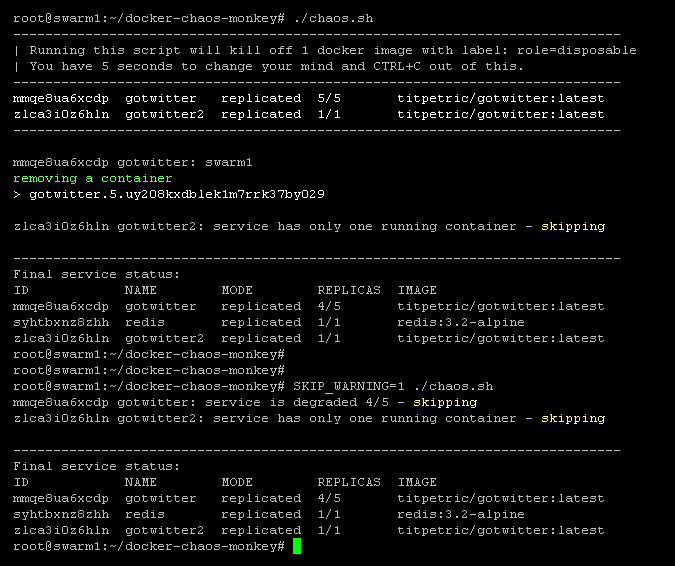

# docker-chaos-monkey

A Chaos Monkey system for Docker and Docker Swarm.

Implemented for the book [12 Factor Applications with Docker and Go](https://leanpub.com/12fa-docker-golang).

# Using Chaos Monkey

Chaos monkey scripts take the following environment variables:

* `DOCKER_LABEL` - default to `role:disposable` - the label of the containers to kill
* `SKIP_WARNING=1` - skip initial warning about chaos monkey being destructive

By default, if a container/service has the label `role=disposable`, then it is considered
to be killed by chaos monkey. It is suggested to customize that label for service groups.

Chaos monkey won't kill the last alive container, but is not concurrency safe. Two deletions
may be triggered in parallel, and both may succeed, bringing all your containers offline.

# Docker / Docker Compose

Running the following would kill off one running local container with the `role:disposable` label.

- `DOCKER_LABEL=role:disposable ./chaos-docker.sh`

You can pass the exact command you want to run on the container as the script arguments.
For example: `chaos-docker.sh (rm|kill|stop) -f`. This allows you to customize the level
with which your containers get killed off. It's would be fun to randomize this.

# Docker Swarm

Running the following would kill off one locally running service container with the `role:disposable` label.

- `DOCKER_LABEL=role:disposable ./chaos.sh`

The script doesn't take any additional arguments.

## Rules

* If the service has only 1 replica (1/1), a container will not be killed.
* If the service has incomplete replicas (4/5), a container will not be killed.
* If no containers are running on the current host, no containers will be killed.
* Only one container per service is killed if the above conditions are met.

## Creating a disposable service (example)

Creating a disposable service is as simple as adding a label `role=disposable`.

~~~
docker service create -l role=disposable --name gotwitter titpetric/gotwitter
~~~

## Screenshot

